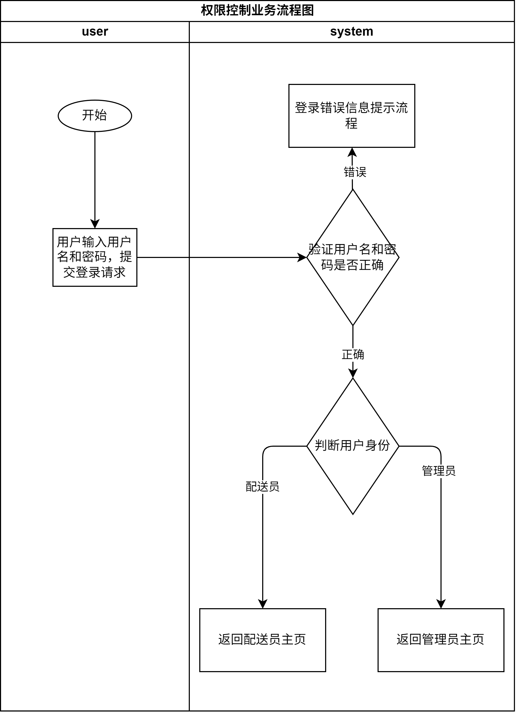

\newpage

[//]: # (# 同城配送管理系统 — 功能详细描述)

## 一、登录管理模块

### 模块功能简介
模块功能说明：
该模块为系统的入口模块，负责用户身份验证与权限控制，确保不同角色进入对应的功能模块。

主要功能描述：

1. 权限控制：
   - 系统根据用户身份区分配送员和系统管理员。
   - 配送员无法访问系统管理模块；管理员拥有系统的最高访问权限。

2. 登录错误信息提示：
   - 当用户输入错误的用户名或密码时，系统弹出相应错误提示信息。
   - 支持多次登录失败后的提示或限制登录操作（选做）。

### 功能 1：权限控制

**功能概述：**  
系统根据用户身份（配送员、系统管理员）进行访问权限控制。  
配送员仅能访问配送员模块；管理员可访问系统管理模块。  
此功能确保不同角色在系统中的操作边界，防止越权访问。

**输入：**

| 输入项 | 类型 | 说明 |
| --- | --- | --- |
| 用户名 | 字符串 | 用户输入的账户名 |
| 密码 | 字符串 | 用户输入的登录密码 |

**输出：**

| 输出项 | 类型 | 说明 |
| --- | --- | --- |
| 登录验证结果 | 布尔 | 表示验证是否通过 |
| 用户角色 | 枚举 | 系统识别的用户角色：`deliveryman` / `admin` |
| 跳转页面 | 页面 | 登录后根据角色跳转的目标模块主页 |

**主要流程：**

1. 用户输入用户名与密码提交登录请求。
2. 系统从数据库中验证用户名与密码是否匹配。
3. 若验证成功，系统判断该用户的角色类型：
   - 配送员：跳转至配送员模块；
   - 系统管理员：跳转至系统管理模块。
4. 若验证失败，则触发登录错误提示流程。
5. 权限控制模块在后续操作中持续生效，防止访问非授权页面。

**数据需求：**

| 数据表 | 主要字段 | 说明 |
| --- | --- | --- |
| `user` | user_id, username, password, role, status | 存储所有用户信息及其角色身份 |
| **关系** | - | `role` 用于区分用户类型（配送员、管理员） |

**流程图：**

 

  
   \begin{center}
      \includegraphics[width=0.7\textwidth]{./tfd/login_permission_flow_diagram.png}
   \end{center}

---

### 功能 2：登录错误信息提示

**功能概述：**  
在用户登录失败时，系统应返回明确的错误提示信息，帮助用户了解失败原因。  
可选功能包括：限制连续登录失败次数、防止暴力破解。

**输入：**

| 输入项 | 类型 | 说明 |
| --- | --- | --- |
| 用户名 | 字符串 | 登录时输入的账户名 |
| 密码 | 字符串 | 登录时输入的密码 |

**输出：**

| 输出项 | 类型 | 说明 |
| --- | --- | --- |
| 提示信息 | 字符串 | 登录失败原因（如“用户名不存在”或“密码错误”） |
| 登录状态 | 枚举 | 成功 / 失败 / 被锁定 |
| 剩余尝试次数（选做） | 数值 | 距离账号暂时锁定的剩余尝试次数 |

**主要流程：**

1. 用户提交登录信息后，系统验证用户名与密码。
2. 若用户名不存在，返回“用户不存在”提示。
3. 若密码错误，返回“密码错误”提示，并记录失败次数。
4. 若失败次数超过设定阈值（如3次），可临时锁定账户并提示用户稍后重试（选做）。
5. 登录成功后，系统清空该用户的登录错误计数。

**数据需求：**

| 数据表 | 主要字段 | 说明 |
| --- | --- | --- |
| `login_log`（选做） | user_id, attempt_time, success_flag, fail_count | 记录用户登录行为，用于限制连续失败登录 |
| `user` | user_id, username, password, status | 存储登录凭证及账户状态 |

**流程图：**

  

  
   \begin{center}
      \includegraphics[width=0.7\textwidth]{./tfd/login_error_handling_flow_diagram.png}
   \end{center}

---

\newpage

## 二、系统管理模块

### 模块功能简介
模块功能说明：
该模块为系统的核心管理后台，仅供具有“系统管理员”角色的用户访问。管理员在此模块中完成账号管理、订单生命周期管理以及数据统计分析工作，确保整个配送流程的顺畅与可控。

主要功能描述：

1.  账号管理：系统管理员能够对管理员账号和配送员账号进行全面的增、删、改、查及密码重置操作。
2.  发布配送信息：管理员可创建新的配送订单，填写详细的收发货地址、费用等信息，订单初始状态为"待接单"，进入抢单池。
3.  跟踪配送信息：管理员能够根据订单号、客户信息等多种条件查询订单，并实时跟踪其配送状态（如：待接单、已接单待取货、配送中、已完成、取消）。
4.  历史配送信息查阅与统计：管理员能够查阅所有历史配送记录，并基于这些数据进行多维度统计。

### 功能1：账号管理

**功能概述：**  
系统管理员通过该功能对两类账号进行全生命周期管理，包括管理账号的增删改查、密码修改，以及配送员账号的创建、信息维护、状态管理（如启用/禁用/锁定），确保账号权限与业务角色精准匹配，避免越权操作。

**输入：**

| 输入项 | 类型 | 说明 |
| --- | --- | --- |
| 账号 ID | 字符串 / 数值 | 唯一标识，修改 / 删除 / 查询时必填|
|用户名 | 字符串 | 6-20 位字母 / 数字组合，不可重复 |
| 初始密码 / 新密码 | 字符串 | 8-20 位含字母 + 数字 + 特殊符号 |
|用户角色 | 枚举 | 固定为admin（管理账号）或deliveryman（配送员账号） |
| 配送员联系方式 | 字符串 | 11 位手机号，仅配送员账号需填写 |
|账号状态 | 枚举 | enabled（启用）/disabled（禁用）/locked（锁定） |

**输出：**

| 输出项 | 类型 | 说明 |
| --- | --- | --- |
| 操作结果提示 | 字符串 | 如 “账号新增成功”“用户名已存在”“密码修改成功” |
| 账号列表 | 列表 | 展示账号 ID、用户名、角色、状态、联系方式、创建时间 |
| 账号详情 | 对象 | 单个账号的完整信息（含加密后的密码，不可明文展示） |
| 操作日志（选做） | 字符串 | 记录 “谁在什么时间执行了什么操作”，用于追溯 |

**主要流程：**

1. 账号新增流程
   - 管理员选择账号类型（管理账号/配送员账号），填写用户名、初始密码、联系方式（仅配送员）和账号状态信息；
   - 系统校验用户名唯一性（查询user表），若已存在则返回错误提示；
   - 校验通过后，对密码进行加密处理，将账号信息存入user表；
   - 返回“新增成功”提示，并刷新账号列表。
2. 账号查询/修改/删除流程
   - 查询：管理员输入账号ID、用户名或用户角色筛选，系统从user表查询匹配数据，以列表形式展示；
   - 修改：管理员点击目标账号“修改”按钮，修改允许变更的字段（如密码、联系方式、状态），系统校验后更新user表，返回成功提示；
   - 删除：管理员选择目标账号“删除”，系统校验该账号是否存在未完成的关联业务（如配送员账号是否有“配送中”任务），若无则删除user表中对应记录，若有则提示“存在未完成的订单，无法删除”。
3. 密码重置流程
   - 管理员选择目标账号（或自己的账号），输入新密码；
   - 系统校新密码符合复杂度要求后，判断新密码是否和原密码相同，若相同则提示“密码重置失败：重置密码不能与原密码相同”，若不同则加密更新user表中 password字段；
   - 返回“密码修改成功”提示。

**数据需求：**

| 数据表 | 主要字段 | 说明 | 与其他模块关联 |
| --- | --- | --- | --- |
| `user` | user_id,username, password,role,status, contact_info（联系信息）,create_time（创建时间）,creator_id（创建人 ID ） | 存储所有用户账户信息。role 用于区分用户类型（配送员、管理员），status字段标识账号状态（启用/禁用）。 | 与登录管理模块共用该表 |
| `operation_log`（选做） | log_id, operator_id, operation_type, operation_obj, operation_time, result | 记录账号操作日志 | operator_id关联user表的user_id（操作人），operation_obj关联被操作账号的user_id |

**流程图：**

 

  
   \begin{center}
      \includegraphics[width=0.7\textwidth]{./tfd/system_management_account_flow_diagram.png}
   \end{center}

---

### 功能2：发布配送信息

**功能概述：**  
系统管理员作为配送需求的发起方，通过该功能录入接货地址、配送地址、配送费用等核心信息，生成初始状态为“待接单”的配送单；可选将该功能封装为WEB SERVICE接口，供第三方应用（如商家系统）调用，实现配送需求的批量/自动接入。

**输入：**

| 输入项 | 类型 | 说明 | 必要性 |
| --- | --- | --- | --- |
|接货地址 | 字符串 | 含省、市、区、详细地址 | 必选 |
| 接货人姓名 | 字符串 | 接收货物的联系人姓名 | 必选 |
| 接货人电话 | 字符串 | 11 位手机号，用于联系接货 | 必选 |
| 配送地址 | 字符串 | 格式同接货地址，为货物最终送达地址 | 必选 |
| 收货人姓名 | 字符串 | 接收货物的联系人姓名 | 必选 |
| 收货人电话 | 字符串 | 11 位手机号，用于联系收货 | 必选 |
| 配送费用 | 数值 | 单位：元，保留 2 位小数 | 必选 |
| 货物类型 | 枚举 | ordinary（普通货物）/fragile（易碎品）/fresh（生鲜） | 必选 |
| 预计配送时效 | 数值 | 单位：小时 | 可选 |
| 货物重量 / 体积 | 数值 | 重量单位：kg，体积单位：m³，用于配送员参考 | 可选 |
| 备注信息 | 字符串 | 如 “需当面签收” “请勿挤压” | 可选 |

**输出：**

| 输出项 | 类型 | 说明 |
| --- | --- | --- |
| 配送单编号 | 字符串 | 唯一标识（如 “DEL20251012001”，含日期 + 流水号） |
| 发布结果提示 | 字符串 | 如 “配送单发布成功，待配送员接单” |
| WEB SERVICE 接口响应（选做）（选做） | JSON/XML | 含code（状态码）、msg（提示）、order_id（配送单编号） |
| 配送单详情页） | 页面 | 展示已发布配送单的所有信息，状态标注为 “待接单” |

**主要流程：**

1.  管理员进入“配送信息发布”页面，填写完整的表单信息。
2.  点击“提交”后，系统对必填字段（如地址、联系方式）进行格式校验。
3.  校验通过后，系统生成唯一配送单编号（规则：前缀“ORD"+日期+3位流水号），将信息存入delivery_order表，状态设为“待接单”（status="pending"）。
4.  系统将订单数据持久化到数据库，并展示“发布成功”提示及配送单编号。
5.  （选做）WebService接口：提供标准接口，第三方系统传入规范参数即可创建订单，返回相同结构的响应。

**数据需求：**

| 数据表 | 主要字段 | 说明 | 与其他模块关联 |
| --- | --- | --- | --- |
| `delivery_order` | order_id（配送单编号）, pickup_addr, pickup_name, pickup_phone, delivery_addr, delivery_name, delivery_phone,fee, goods_type, expected_time, weight, volume, remark, status, create_time, creator_id | 存储配送单核心信息。status记录订单生命周期状态。 | creator_id关联user表的user_id（发布人，即管理员），后续配送员模块需读取该表“待接单”数据 |
| `api_key`（选做） |key_id, app_name, api_key, status, create_time | 存储第三方应用的接口密钥 | 用于 WEB SERVICE 接口的身份验证，仅状态为“启用”的密钥可调用接口 |

**流程图：**

 

  
   \begin{center}
      \includegraphics[width=0.7\textwidth]{./tfd/system_management_delivery_publish_flow_diagram.png}
   \end{center}

---

### 功能3：跟踪配送信息

**功能概述：**  
系统管理员通过该功能实时查询配送单的当前状态（待接单/已接单待取货/配送中/已完成/取消），并查看配送全流程节点信息（如“谁接单”“何时开始配送”“何时送达”），支持按多条件组合查询，确保对配送进度的实时管控。

**输入：**

| 输入项 | 类型 | 说明 | 查询逻辑 |
| --- | --- | --- | --- |
| 配送单编号 | 字符串 | 精确匹配（如 “ORD20251012001”） | 输入后优先按编号查询，结果唯一 |
| 接货人电话 | 字符串 | 11 位手机号，模糊匹配 | 可单独输入，或与其他条件组合 |
| 收货人电话 | 字符串 | 11 位手机号，模糊匹配 | 可单独输入，或与其他条件组合 |
| 配送员 ID / 姓名 | 字符串 | 匹配配送员账号的user_id或username | 仅查询该配送员负责的配送单 |
| 配送状态 | 枚举 | pending（待接单）/delivering（配送中）/completed（已完成）/cancelled（取消） | 筛选指定状态的配送单|
| 时间范围 | 日期区间 | 如“2025-10-01 至 2025-10-12” | 筛选该时间段内创建的配送单 |

**输出：**

| 输出项 | 类型 | 说明 |
| --- | --- | --- |
| 配送单列表 | 列表 | 展示匹配条件的所有配送单，含订单号、接货地址（脱敏，如“北京市海淀区 ***”）、配送状态、创建时间 |
| 配送单详情 | 对象 | 点击列表项后展示，含所有字段（地址、联系人、货物类型、费用）+ 配送节点信息（接单时间、配送员、送达时间） |
| 空结果提示 | 字符串 | 如“未查询到符合条件的配送单，请调整查询条件” |

**主要流程：**      
1.  管理员进入“配送信息跟踪”页面，选择查询条件（如输入配送单编号，或选择状态为“配送中”+时间范围）。      
2.  点击“查询”按钮，系统根据输入条件拼接SQL查询语句，从delivery_order表和delivery_trace表（跟踪节点）关联查询。    
3.  若有匹配数据，以列表形式展示核心信息；若无可匹配数据，返回空结果提示。    
4.  管理员点击某配送单编号，跳转至详情页，系统展示该配送单的完整信息及所有跟踪节点（如“2025-10-12 10:00 配送单创建，待接单”“2025-10-12 10:30 配送员张三接单，状态变更为配送中”）。     

**数据需求：**

| 数据表 | 主要字段 | 说明 | 与其他模块关联 |
| --- | --- | --- | ---|
| `delivery_order` | order_id, pickup_addr, pickup_name, pickup_phone, delivery_addr, delivery_name, delivery_phone, fee, goods_type, status, create_time | 存储配送单基础信息 | 与配送员模块共用，配送员接单 / 完成后会更新status字段 |
| `delivery_trace` | trace_id, order_id, status, operator_id, operate_time, remark | 存储配送单状态变更的节点信息 | order_id关联delivery_order表的order_id，operator_id关联user表的user_id（操作人，如接单的配送员） |
| `user` |user_id, username, contact_info| 存储配送员姓名、联系方式 | 详情页展示“配送员信息”时，通过operator_id关联查询 |

**流程图：**

  
\begin{center}
   \includegraphics[width=0.7\textwidth]{./tfd/system_management_delivery_trace_flow_diagram.png}
\end{center}

---

### 功能4：历史配送信息查阅与统计

**功能概述：**  
系统管理员通过该功能查询所有已完成/已取消的历史配送单，并基于历史数据生成统计报表（如指定时间段内的总订单量、平均配送时长、各区域订单分布），支持数据导出（选做），为业务优化提供数据支撑。

**输入：**

| 输入项 | 类型 | 说明 | 统计维度关联 |
| --- | --- | --- | --- |
| 统计时间范围 | 日期区间 | 如“2025-09-01 至 2025-09-30” | 核心筛选条件，所有统计基于该时间段 |
| 配送状态 | 枚举 | 仅completed（已完成）/cancelled（取消） | 筛选历史订单的状态范围 |
| 区域范围 | 字符串 | 如“北京市海淀区”“上海市” | 按接货 / 配送地址的区域筛选 |
| 货物类型 | 枚举 | ordinary/fragile/fresh | 按货物类型分类统计 |

**输出：**

| 输出项 | 类型 | 说明 |
| --- | --- | --- |
| 历史配送单列表 | 列表 | 展示符合条件的历史订单，含订单号、状态、接货 / 配送地址、费用、完成 / 取消时间 |
| 统计汇总表 | 表格 | 展示核心统计指标：总订单数、完成订单数、取消订单数、完成率（完成数 / 总数）、平均配送时长（完成订单的时长均值） |
| 统计图表（选做） | 饼图 / 柱状图 | 饼图：展示各状态订单占比；柱状图：展示每日订单量 / 各区域订单量；折线图：展示订单量趋势 |
| 数据导出文件（选做） | Excel/CSV | 包含历史订单列表或统计汇总表的完整数据，支持管理员下载 |

**主要流程：**

1. 历史配送单查阅流程
    - 管理员进入“订单管理”页面，选择时间范围、状态（默认“已完成”）等条件；
    - 点击“查询”，系统从delivery_order表查询状态为“已完成/取消”且在时间范围内的订单；
    - 以列表形式展示，支持按“完成时间”降序排序，管理员可点击订单号查看详情。
2. 统计流程
    - 管理员在查阅页面点击“生成统计报表”，系统基于当前查询条件计算核心指标：
        - 总订单数：符合条件的订单总量；
        - 总收入：符合条件的订单收入的总量；
        - 平均配送时长：所有完成订单的“送达时间-接单时间”的均值；
    - 系统以热力图形式展示统计结果，生成折线图；
    - 管理员可点击“导出数据”，系统将统计结果或历史订单列表生成 Excel/CSV 文件供下载（选做）。

**数据需求：**

| 数据表 | 主要字段 | 说明 | 统计逻辑依赖 |
| --- | --- | --- | --- |
| `delivery_order` | order_id, status, create_time, complete_time, cancel_time, pickup_addr, delivery_addr, goods_type, fee | 存储历史订单的核心数据 | 时间范围依赖create_time，状态依赖status，区域统计依赖pickup_addr/delivery_addr |
| `delivery_trace` |order_id, status, operate_time | 存储状态变更时间 | 平均配送时长计算依赖“接单时间”（status="delivering"的operate_time）和“完成时间”（status="completed"的operate_time） |
| `user` | user_id, username | 存储配送员信息 | 可选按“配送员”维度统计时，关联delivery_trace表的operator_id查询姓名 |

**流程图：**

 

  
   \begin{center}
      \includegraphics[width=0.7\textwidth]{./tfd/system_management_history_delivery_flow_diagram.png}
   \end{center}

\newpage

## 三、配送员模块

### 模块功能简介
模块功能说明：
该模块为配送员提供专属操作入口，支持移动端 web 或 app 访问。配送员通过此模块完成登录、个人信息维护、订单抢单、配送状态更新及历史订单查询等核心操作，是连接系统管理端与实际配送服务的关键环节，确保配送流程高效执行。

主要功能描述：

1.  登录验证：配送员使用电话和密码登录该模块，系统校验身份合法性；。
2.  个人信息管理：支持配送员查看和修改个人资料、密码及工作状态。
3.  订单与状态管理：展示当前所有待接单配送信息，无在途任务的配送员可抢单。​
4.  我的历史查询：配送员可查看个人所有配送完成的订单。

### 功能1： 登录验证模块 
 
**功能概述：**
登录与安全认证模块主要用于配送员身份验证与权限控制，通过手机号和密码登录系统，校验账户状态与合法性，创建安全会话并记录登录日志，同时依据角色类型限制访问权限，保障系统安全与账户使用规范。

 **输入：**

| 输入项 | 类型 | 说明 |
| --- | --- | --- |
| 电话 | String | 管理员分配的账号，唯一标识。 |
| 密码 | String | 初始密码或重置密码，MD5 加密传输。 |

**输出：**

| 输出项 | 类型 | 说明 |
| --- | --- | --- |
| 登录结果提示 | String | 如 “登录成功”、“账号已禁用”、“密码错误”。 |
| 登录状态 | 枚举 | 成功 / 失败 / 被锁定 |
| 剩余尝试次数 | 数值 | 距离账号暂时锁定的剩余尝试次数 |

**主要流程：**

1.  配送员输入自己的电话号码和密码（密码经 MD5 加密传输）；
2.  系统验证账号是否存在、是否被禁用、密码是否正确；
3.  登录成功后创建 Session（有效期 30 分钟），存储配送员 ID、状态信息；
4.  登录即写入 Cookie（有效期 7 天）；
5.  登录成功跳转配送员工作台；

 **数据需求：**

| 数据表 | 主要字段 | 说明 |
| --- | --- | --- |
| `delivery_man` | id, username, password, work_status, role_type, login_fail_count, account_lock_time | 用于登录认证与角色区分 |
| `AccountSecurityLog` | id, delivery_man_id, loginTime, loginResult | 记录登录行为日志，用于安全追踪 |

**流程图：**

 

  
   \begin{center}
      \includegraphics[width=0.7\textwidth]{./tfd/deliveryman_login_flow_diagram.png}
   \end{center}

---

### 功能2： 个人信息管理模块  

**功能概述：**  
配送员可通过该功能维护个人核心信息，包括查看个人信息、查看本月工作统计、修改登录密码（确保账号安全）、修改手机号（便于接收订单通知或紧急联系）。

 **输入：**

| 输入项 | 类型 | 说明 |
| --- | --- | --- |
| 新手机号 | String | 11 位数字 |
| 确认新手机号 | String | 11 位数字 |
| 新密码 | String | 修改密码时必填 |
| 确认新密码 | String | 修改密码时必填 |

 **输出：**

| 输出项 | 类型 | 说明 |
| --- | --- | --- |
| 操作结果提示 | String | 如“信息修改成功”、“原密码错误” |
| 更新后的信息 | Object | 展示当前配送员资料（姓名、手机号等） |

 **主要流程：**

1. 修改密码流程；
   - 配送员进入 “个人中心”→“修改密码” 页面，输入新密码、确认新密码；
   - 系统校验：  
      - 新密码是否符合复杂度要求；
      - 新密码与确认新密码是否一致；
   - 若校验失败：返回对应错误提示；
   - 若校验通过：更新user表中该配送员的password字段，返回 “密码更新成功” 提示。
2. 修改手机号流程：
   - 配送员进入 “个人中心”→“修改手机号” 页面，输入新手机号；
   - 系统校验：
      - 新手机号格式是否正确；
      - 新手机号与确认新手机号是否一致；
   - 若校验失败：返回 “手机号格式错误” 提示；
   - 若校验通过：更新user表中该配送员的contact_info字段，返回 “联系方式更新成功” 提示，并刷新 “个人中心” 页面展示新手机号。

**数据需求：**

| 数据表 | 主要字段 | 说明 |
| --- | --- | --- |
| `delivery_man` | id, phone, emergency_contact, password, work_status, update_time | 储存并更新用户个人资料与工作状态 |

**流程图：**

 

  
   \begin{center}
      \includegraphics[width=0.7\textwidth]{./tfd/personal_information_management_flow_diagram.png.png}
   \end{center}

---

### 功能3：订单与状态管理模块  

**功能概述：**  
该功能是配送员核心业务操作模块，包含 “待接单列表查看”“我的在途订单”“配送状态更新” 三大核心环节；系统实时同步待接单数据，仅允许在线且无在途任务的配送员抢单。

 **输入：**

| 输入项 | 类型 | 说明 |
| --- | --- | --- |
| 异常类型 | Enum | 放弃订单、用户取消、配送中异常 |
| 确认操作 | 布尔 | 点击 “确认抢单”“确认完成” 按钮，触发操作 |

 **输出：**

| 输出项 | 类型 | 说明 |
| --- | --- | --- |
| 订单结果提示 | String | “确认取货” |
| 当前订单状态 | Enum | pending, delivering, picked_up, completed, aborted, cancelled。 |
| 异常处理结果 | String | “放弃订单审核通过 / 驳回”。 |
| 通知内容 | String | 实时通知配送员状态变化。 |

**主要流程：**

1. 配送员进入“外卖员工作台”，查看可接单订单并修改自己的工作状态；
2. 配送员点击目标订单的 “接单” 按钮，系统先校验该配送员是否有在途订单： 
   - 若有在途订单：返回 “您当前已有进行中的订单，一次只能接一单” 提示；
   - 若无在途订单：则接单成功，更新为“已接单待取货”；
3. 配送状态更新流程：
   - 取货后更新为 “配送中”：配送员点击“确认取货”，系统更新后显示“配送中”；
   - 送达后更新为 “已完成”：配送员到达配送地址并完成交付后，点击 “确认送达”，返回 “配送完成” 提示，清空当前在途任务标记。

 **数据需求：**

| 数据表 | 主要字段 | 说明 |
| --- | --- | --- |
| `delivery_order` | order_id, delivery_man_id, status, sender_addr, receiver_addr, fee, accept_time, complete_time, abort_reason, cancel_reason, reviewer_id | 储存订单生命周期数据。 |
| `delivery_trace` | trace_id, order_id, status, operator_id, operate_time, remark | 记录订单状态变更节点和更新状态时新增记录 |

**流程图：**

 

  
   \begin{center}
      \includegraphics[width=0.7\textwidth]{./tfd/order_and_status_management_flow_diagram.png}
   \end{center}

---

### 功能4：我的历史查询模块  

**功能概述：**
该模块专为配送员查询个人历史订单设计，核心支持按订单号降序排列，同时提供单订单详情查看功能；通过清晰的订单数据展示与精准的详情回溯，帮助配送员快速掌握个人工作完成情况，便于核对工作记录与复盘业务效率。

**输入：**

| 输入项 | 类型 | 说明 |
| --- | --- | --- |
| 排序方式选择 | 枚举 | 仅支持 “订单号降序”（默认），按订单编号生成规则（前缀 + 日期 + 流水号）倒序排列，最新订单置顶 |
| 详情查看触发 | 操作指令（点击） | 点击历史订单列表中的任意订单项的查看详情，触发详情查看功能 |
| 筛选方式 | Enum | 按时间/费用排序 |

**输出：**

| 输出项 | 类型 | 说明 |
| --- | --- | --- |
| 历史订单列表 | 列表 | 按 “订单号降序” 展示匹配条件的历史订单 |
| 订单详情页面 | 页面 | 点击列表项后展示，含订单完整信息 |

**主要流程：**

1. 订单详情查看流程：
   - 配送员点击历史订单列表中的查看详情，系统获取该订单的order_id；
   - 系统通过order_id关联查询delivery_order表（获取订单基础 / 地址 / 货物信息）和delivery_trace表（获取接单、取货、送达时间等操作记录）；
   - 数据查询完成后，以新页面形式展示订单详情，支持 “返回工作台” 操作，返回列表后保持原筛选与排序状态；

**数据需求：**

| 数据表 | 主要字段 | 说明 |
| --- | --- | --- |
| `delivery_order` | order_id, deliveryman_id, status, complete_time, pickup_name, pickup_phone, pickup_addr, delivery_name, delivery_phone, delivery_addr, fee, goods_type, remark | 存储历史订单核心数据，用于生成列表与详情页的基础 / 地址 / 费用信息 |
| `user` | user_id, username | 存储配送员 ID 与用户名，用于确认当前查询的订单归属（确保仅展示该配送员的历史订单） |

**流程图：**

 

  
   \begin{center}
      \includegraphics[width=0.7\textwidth]{./tfd/my_historical_query_flow_diagram.png}
   \end{center}

---
