<!-- # 同城配送管理系统使用说明书

## 目录

- [第一章 引言](#1-引言)
- [第二章 系统概述](#2-系统概述)
- [第三章 系统安装与运行](#3-系统安装与运行)
- [第四章 系统功能操作说明](#4-系统功能操作说明) -->

\newpage

<!-- TODO
1. 标号的'.'要统一
2. 图片链接的问题 -->

## 1. 引言

### 1.1 编写目的

本使用说明书旨在指导用户正确安装、配置和使用同城配送管理系统，帮助系统管理员与配送员熟悉系统的主要功能与操作方法。    

说明书主要介绍系统的功能模块、运行环境、安装步骤以及操作流程，确保用户能够顺利完成系统部署与日常使用。

### 1.2 适用范围

本说明书适用于：

- 系统管理员：负责管理用户账号、订单数据、系统参数与统计分析；

- 配送员：负责接收配送任务、更新订单状态与查看配送历史；

- 系统维护人员：负责部署、升级与维护服务器环境。

### 1.3 读者对象

本说明书面向以下人员：

- 使用该系统的管理人员与配送员；

- 系统测试与运维人员；

- 项目验收人员及相关评审人员。

### 1.4 使用说明书结构
<!-- TODO -->
本说明书共分为以下几部分：
- 引言：说明文档目的与适用范围；

- 系统概述：介绍系统的总体功能与技术环境；

- 系统安装与运行：指导用户完成系统部署与登录操作；

- 系统功能操作说明：详细说明各功能模块的使用步骤；

- 数据维护与安全管理：介绍数据备份、安全策略等内容。

## 2. 系统概述

### 2.1 系统简介

**同城配送管理系统是**一款基于 Java Web 技术开发的 B/S 架构管理平台，采用传统 MVC 架构模式，前端使用 **JSP + Bootstrap** 实现页面布局与交互，后端使用 **Servlet + JDBC** 进行业务逻辑处理与数据库访问。

该系统主要用于**城市内短距离快递与配送业务的管理与跟踪**，实现了从订单创建、配送任务分配、状态跟踪到数据统计的全流程信息化管理。系统支持多角色登录，主要包括：

- **系统管理员**：负责用户管理、订单管理、数据统计、系统配置；

- **配送员**：负责查看可接订单、更新配送状态、查看历史任务。

通过本系统，可有效提升配送效率、降低人工管理成本、提高用户满意度。

### 2.2 系统功能结构

系统主要划分为两大功能模块：

| 模块名称       | 主要功能                             |
| ---------- | -------------------------------- |
| **系统管理模块** | 用户账号管理、配送信息发布、订单跟踪、数据统计、密钥管理等功能。 |
| **配送员模块**  | 查看待接订单、接单与更新状态、上报完成情况、查看历史记录等功能。 |

### 2.3 系统运行环境

| 项目          | 配置说明                                              |
| ----------- | ------------------------------------------------- |
| **操作系统**    | Windows 10 及以上 / Linux 发行版（推荐 openEuler / Ubuntu） |
| **开发语言**    | Java 8                                            |
| **JDK 版本**  | JDK 1.8 及以上                                       |
| **Web 服务器** | Apache Tomcat 8.5.72                              |
| **数据库**     | MySQL 8.0                                         |
| **项目构建工具**  | Maven                                             |
| **前端框架**    | JSP + Bootstrap + jQuery                          |
| **浏览器要求**   | Chrome、Edge、Firefox、Safari 等现代浏览器                 |

### 2.4 系统特点

1. 模块化设计：采用 MVC 分层结构，逻辑清晰、易于维护与扩展；

2. 响应式页面：基于 Bootstrap，实现 PC 端与移动端兼容显示；

3. 角色权限控制：管理员与配送员界面独立，功能权限分明；

4. 数据统计可视化：提供订单状态、完成率、配送效率等图表统计；

5. 易部署易维护：无需复杂配置即可快速运行，支持 Tomcat 热部署。

## 3. 系统安装与运行

1. 启动 Tomcat 服务；
2. 在浏览器中访问 http://localhost:8080/cdms ；
3. 输入初始管理员的用户名（admin）与密码（1234），即可进入系统管理界面。

## 4. 系统功能操作说明

### 4.1 登录管理模块

<!-- TODO -->
- 打开系统首页，自动跳转到登录界面

> **提示：** 若登录失败，系统会提示“账号或密码错误，请重新输入”。

### 4.2 系统管理模块

#### 功能一：用户管理

1. **进入用户管理页面**  
   点击导航栏中的“用户管理”菜单，查看所有用户及其详细信息。  

   
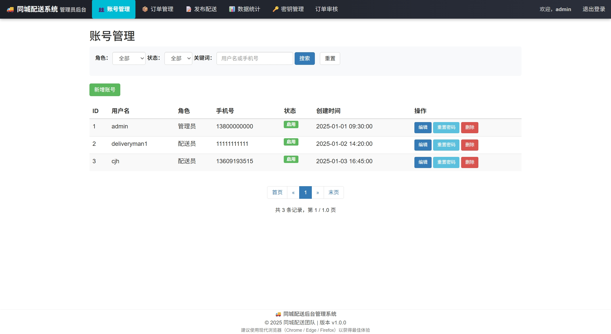
  
   \begin{center}
      \includegraphics[width=0.7\textwidth]{./img/账号管理页面.jpeg}
   \end{center}

2. **新增账号**  
   点击“新增账号”按钮，进入账号新增页面，填写用户信息后点击“提交”。  

   
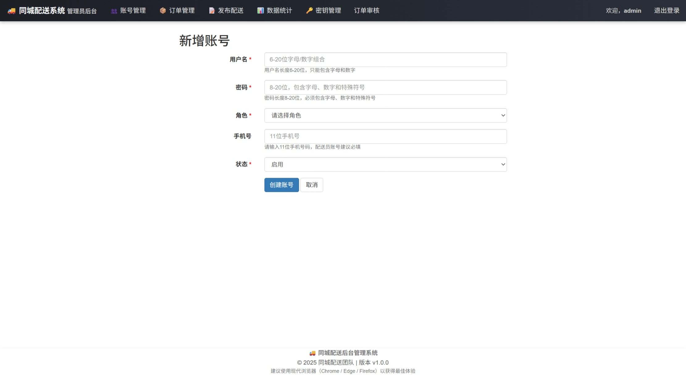
  
   \begin{center}
      \includegraphics[width=0.7\textwidth]{./img/账号新增.jpeg}
   \end{center}

3. **编辑账号**  
   点击账号列表中对应的“编辑”按钮，修改用户基本信息后保存。  

   
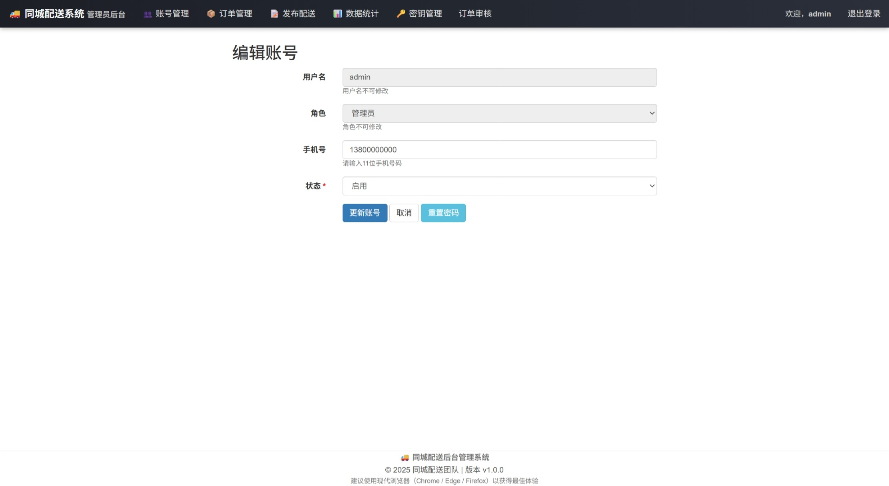
  
   \begin{center}
      \includegraphics[width=0.7\textwidth]{./img/账号编辑.jpeg}
   \end{center}

4. **搜索与筛选**  
   可通过账号角色、状态或关键词进行模糊搜索，快速定位用户。  

   

  
   \begin{center}
      \includegraphics[width=0.7\textwidth]{./img/账号搜索.jpeg}
   \end{center}

#### 功能二：发布配送信息

1. **进入发布页面**  
   点击导航栏中的“发布配送”菜单，打开配送信息发布界面。  

   
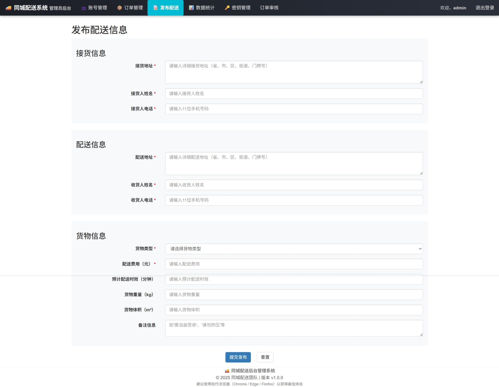
  
   \begin{center}
      \includegraphics[width=0.7\textwidth]{./img/配送信息发布.jpeg}
   \end{center}

2. **填写并提交配送信息**  
   填写配送相关信息（寄件人、收件人、联系方式、物品描述等），点击“提交发布”按钮。  

   

  
   \begin{center}
      \includegraphics[width=0.7\textwidth]{./img/配送信息发布成功.png}
   \end{center}

> **系统提示：** 提交成功后会弹出提示“订单创建成功”，并生成唯一订单编号。

#### 功能三：跟踪配送信息

1. **进入订单管理页面**  
   点击导航栏中的“订单管理”菜单，打开订单管理界面。 

   
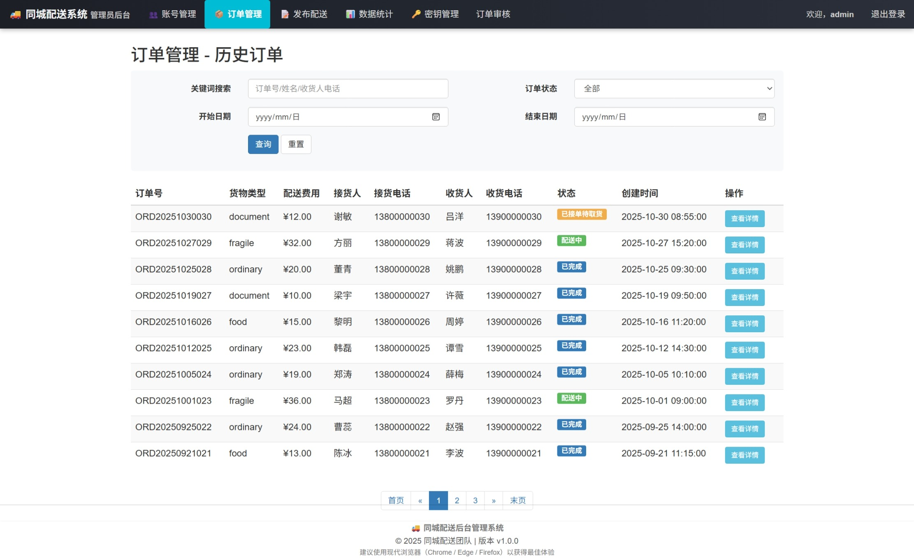

   \begin{center}
      \includegraphics[width=0.7\textwidth]{./img/订单管理.jpeg}
   \end{center}

2. **跟踪配送信息**   
   点击“查看详情”按钮，可以查看该订单的详细信息，以及实时跟踪订单配送状态。

   
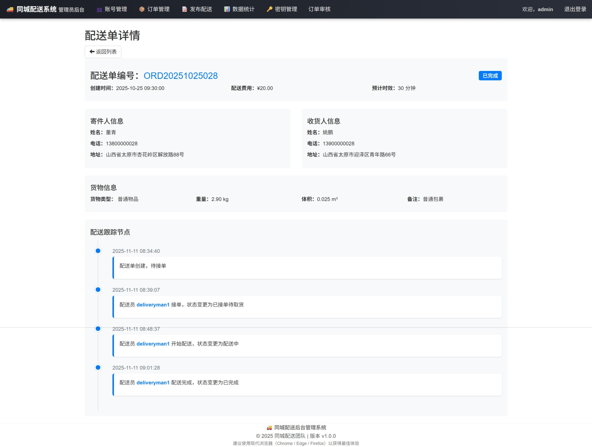

   \begin{center}
      \includegraphics[width=0.7\textwidth]{./img/订单详细信息.jpeg}
   \end{center}

3. **搜索与筛选**   
   可根据关键词、订单状态和时间范围搜索筛选订单。

   
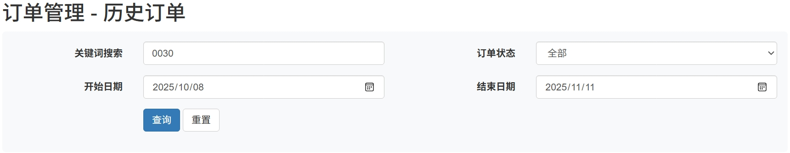

   \begin{center}
      \includegraphics[width=0.7\textwidth]{./img/订单搜索.jpeg}
   \end{center}

#### 功能四：统计数据

1. **进入数据统计页面**   
   点击导航栏中的“数据统计”菜单，打开数据统计界面，可以查看总订单数、总收入、平均配送时长以及各地区订单数量热力图和历史订单趋势图。

   

   \begin{center}
      \includegraphics[width=0.7\textwidth]{./img/数据统计.jpeg}
   \end{center}

2. **时间范围选择**   
   支持选择统计数据的时间范围。

   
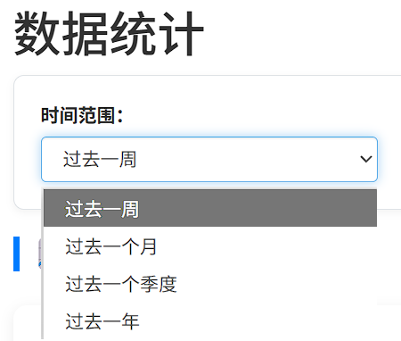

   \begin{center}
      \includegraphics[width=0.7\textwidth]{./img/数据统计时间范围.png}
   \end{center}

#### 功能五：密钥管理

1. **进入密钥管理页面**   
   点击导航栏的“密钥管理”菜单，进入密钥管理界面，可查看历史所有密钥。

   
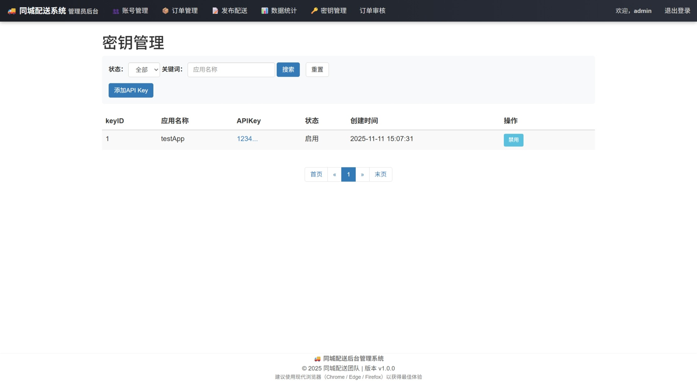

   \begin{center}
      \includegraphics[width=0.7\textwidth]{./img/密钥管理界面.jpeg}
   \end{center}

2. **添加密钥**
   点击“添加API Key”按钮，输入应用名称，可以生成一个新的密钥。

   
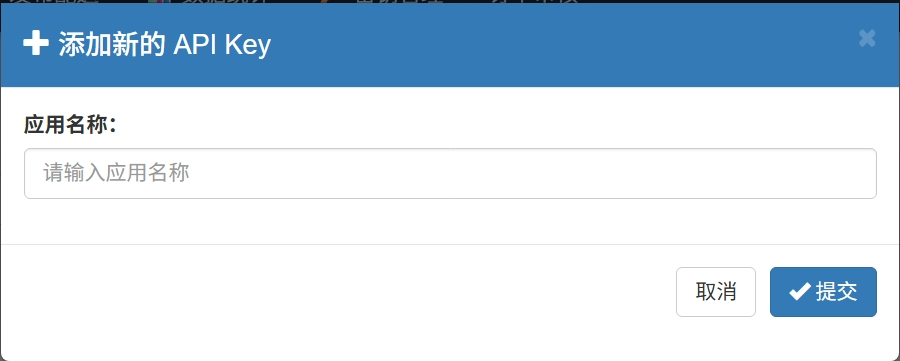

   \begin{center}
      \includegraphics[width=0.7\textwidth]{./img/密钥添加弹窗.jpeg}
   \end{center}

   添加成功：
   
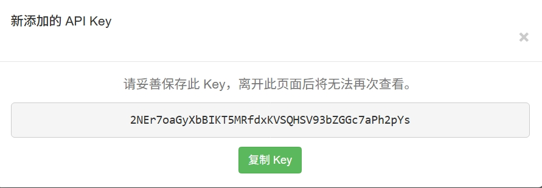

   \begin{center}
      \includegraphics[width=0.7\textwidth]{./img/账号新增.jpeg}
   \end{center}

   如果应用名称已经存在，则添加失败:
   

   \begin{center}
      \includegraphics[width=0.7\textwidth]{./img/密钥添加失败.jpeg}
   \end{center}

3. **密钥的启用与禁用**   
   对于现有的密钥，管理员可以启用被禁用的密钥，也可以禁用正在使用的密钥。

   
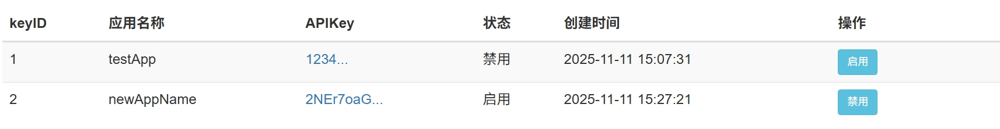

   \begin{center}
      \includegraphics[width=0.7\textwidth]{./img/密钥的启用与禁用.jpeg}
   \end{center}

> **安全提示：** 请妥善保管密钥信息，不要泄露给第三方。

#### 功能六：订单审核

1. **进入订单审核页面**   
   点击导航栏的“订单审核”菜单，打开订单审核页面，可查看配送员放弃订单的申请。
   
   
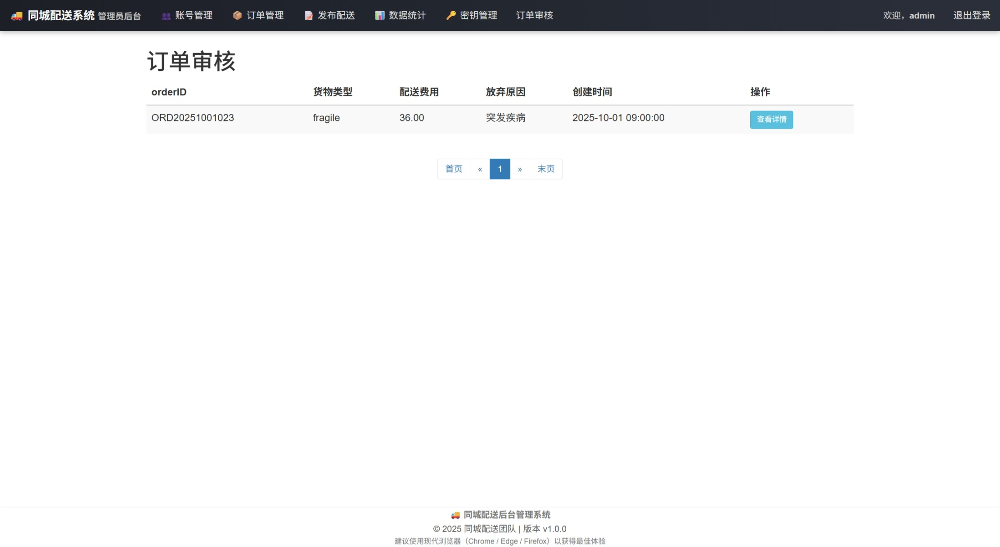

   \begin{center}
      \includegraphics[width=0.7\textwidth]{./img/订单审核界面.jpeg}
   \end{center}

2. **审核订单**   
   管理员根据配送员放弃的订单的原因，决定是否通过申请。

   
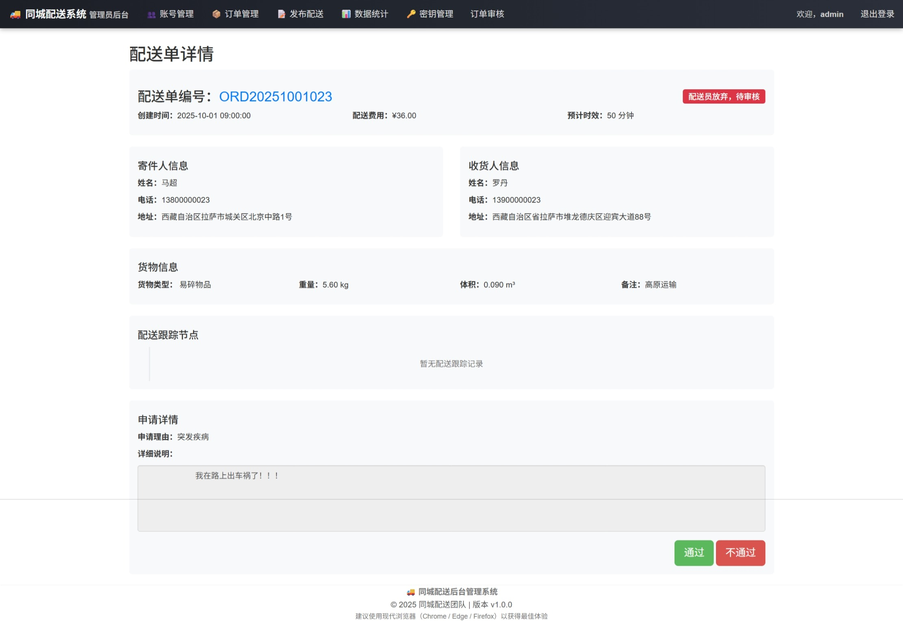

   \begin{center}
      \includegraphics[width=0.7\textwidth]{./img/订单审核详情.jpeg}
   \end{center}

### 4.3 配送员模块（移动端 Web/App）

#### 功能一：登录与注册

1. **登录入口**  
   配送员通过移动端访问系统，进入 “外卖员登录” 界面 ，界面包含手机号输入框、密码输入框、功能链接（“忘记密码？”“还没账号？去注册”“管理员登录”）、“登录” 按钮。

   

  
   \begin{center}
      \includegraphics[width=0.7\textwidth]{./img/账号管理页面.jpeg}
   \end{center}

2. **登录流程**  
   输入管理员分配或自主注册的手机号；  
   输入对应密码；  
   点击 “登录” 按钮，验证通过后跳转至 “外卖员工作台”。  

   

  
   \begin{center}
      \includegraphics[width=0.7\textwidth]{./img/账号新增.jpeg}
   \end{center}

4. **辅助功能**  
   忘记密码：点击 “忘记密码？”，通过手机号验证流程找回密码；  
   注册账号：点击 “还没账号？去注册”，进入 “外卖员注册” 界面，填写用户名、手机号、设置密码及确认密码，点击 “立即注册” 完成账号创建；  
   管理员登录：点击 “管理员登录” 可切换至系统管理端入口。  

   

  
   \begin{center}
      \includegraphics[width=0.7\textwidth]{./img/账号编辑.jpeg}
   \end{center}

#### 功能二：外卖员工作台

1. **工作状态管理**  
   界面顶部显示当前状态，支持点击按钮切换当前状态。

   

  
   \begin{center}
      \includegraphics[width=0.7\textwidth]{./img/配送信息发布.jpeg}
   \end{center}

2. **待接单订单处理**  
   列表展示订单信息（订单号、商家信息、收货信息、货物类型、配送费、预计时间）；  
   点击 “刷新列表” 获取最新订单；  
   点击订单 “接单” 按钮进行抢单。  

   

  
   \begin{center}
      \includegraphics[width=0.7\textwidth]{./img/配送信息发布成功.png}
   \end{center}

> **系统提示：** 接单成功后会弹出提示“操作成功”，订单进入 “我的在途订单”。  
> **系统提示：** 接单失败后会弹出提示“您当前已有进行中的订单，一次只能接一单”。

3. **我的在途订单**  
   展示当前处理中订单，点击订单可进入 “订单详情页”，执行 “确认取货”“确认送达” 操作。

   

  
   \begin{center}
      \includegraphics[width=0.7\textwidth]{./img/配送信息发布成功.png}
   \end{center}

#### 功能三：个人中心

1. **基本信息查看**  
   进入 “个人中心” 后，展示工号、用户名、手机号、当前状态（在线 / 休息 / 离线）。

   

   \begin{center}
      \includegraphics[width=0.7\textwidth]{./img/订单管理.jpeg}
   \end{center}

2. **工作统计**   
   “个人中心” 页面也可以实时查看工作统计（总完成订单数、本月完成订单数、本月收益）。

   

   \begin{center}
      \includegraphics[width=0.7\textwidth]{./img/订单详细信息.jpeg}
   \end{center}

3. **功能操作**   
   修改密码：点击 “修改密码”，输入新密码及确认密码，完成更新；  
   查看历史订单：点击 “查看历史订单”，进入历史列表，可查看 “已完成”订单；  
   修改手机号：点击 “修改手机号”，输入新手机号并验证，完成绑定更新。  

   

   \begin{center}
      \includegraphics[width=0.7\textwidth]{./img/订单搜索.jpeg}
   \end{center}

#### 功能四：订单详情与历史查询

1. **订单详情页面**   
   点击在途或历史订单，进入详情页，展示配送路线（商家位置、收货位置、预计时效）、寄件人 / 收货人信息（姓名、电话、地址）、货物类型、配送费、已完成订单显示 “已完成” 标签。

   

   \begin{center}
      \includegraphics[width=0.7\textwidth]{./img/数据统计.jpeg}
   \end{center}

2. **历史订单查询**   
   点击 “历史订单”，进入 “我的历史订单” 页面，查看所有历史配送记录。

   

   \begin{center}
      \includegraphics[width=0.7\textwidth]{./img/数据统计时间范围.png}
   \end{center}
